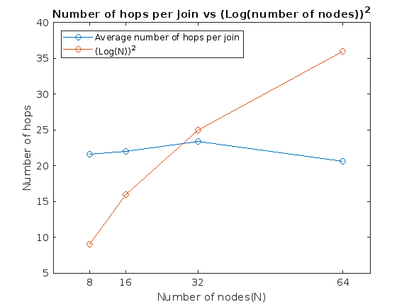

<h1 align="center">
<br>

<br>
<strong>ChordSeek: A Scalable Peer-to-Peer Lookup CLI Tool</strong>
</h1>


<h3 align="center">
<i>A command-line interface (CLI) tool for rapid lookups based on the Chord protocol using Docker containers and the gRPC framework, aiming to support scalable and isolated peer-to-peer communication</i>
</h3>
<br>

[![License][license-badge]][license-link]

# 🚩 Table of Contents
* [About the Project](#about-the-project)
* [Project Status](#project-status)
* [Installation](#installation)
* [Architecture](#architecture)
* [Methodology and Results](#methodology-and-results)
* [Usage](#usage)
* [Contact](#Contact)
* [License](#License)


# About the Project

This project focuses on developing a Python CLI tool aiming to provide rapid range queries (logarithmic time complexity) and employed on a dataset consisting of famous computer scientists scraped from Wikipedia. 

# Project Status

The current project was carried out as a part of [CEID's][CEID-link] course "Decentralized Systems for Big Data Managment and Decision Making" taught by Prof. Spyros Sioutas. While the primary goal was to optimize time complexity, matters such as concurrency support and allowing for simultaneous handling of requests were not a central aspect in our implementation. As such, there are multiple areas that enhancements can be made, including but not limited to improving the web crawler's efficiency and adding concurrency support in terms of network's nodes sudden joins and leaves. 

In the pursuit of self-improvement, any new suggestions, solutions and potential bug fixes are welcome.

# Installation

Before using ChordSeek, ensure you have Docker installed and that your user is added to the Docker group. You can follow the official detailed guides for these matters in the links below:
- https://docs.docker.com/engine/install/linux-postinstall/
- https://docs.docker.com/engine/install/

As for the installation of the CLI tool you must install the required libraries through requirements.txt,
preferably in a virtual environment(e.g. using venv) as can be seen below:
```bash
# Navigate to project's root folder
cd ChordSeek

# Create the venv
python3 -m venv dhtChordVenv

# Activate the virtual environment
# E.g. for an Ubuntu distribution: source dhtChordVenv/bin/activate

pip3 install -r requirements.txt
```
> [!CAUTION]  
> **dhtChordVenv** should be the name of the virtual environment because of an unresolved dependency to the empty message definition for Google's protobuffers. A quick fix is specifying to protoc compiler the path where it would be naturally defined inside gRPC tools installation folder. For a virtual environment created with venv this was located at ***```[the name of your venv]/lib/python3.8/site-packages/grpc_tools/_proto/"```*** at the time of development.<br> This is hard coded in line ***153*** of [__netsetup__]:  
``` 
f"--proto_path=dhtChordVenv/lib/python3.8/site-packages/grpc_tools/_proto/"
```
Any fix better than the current one is a welcome addition.

# Architecture

The project's implementation is based on the research presented in this [paper][Chord-Paper-Link].

For the purpose of designing and implementing our peer-to-peer chord network we used a state-of-the-art solution, that of [Docker][Docker-link] containers. Each peer, a chord node, is modeled as a container, inside a standalone docker network. 
## Chord Network

### Initialization

The initialization of the chord network is carried out by a single node(not part of the Chord) and is responsible for each of the following:
- Initialization of each Finger Table(FT) in a randomized way as far as node selection is concerned. 
- Fetching Wikipedia's data using the implemented Web Crawler.
- Distributing the data across the Chord network properly (according to each node's id).

### Communication 

Concerning the implementation of the communication between the nodes, we've followed the route of the RPC means of communication, selecting Google's implementation, the [gRPC][gRPC-link] framework mainly for its simplicity and high performance capabilities. Each node as part of a peer-to-peer network acts both as a server and client to its fellow peers, accepting and responding to their requests.

### Storage

As far as storage is concerned, each node maintains a SQLite3 database for data persistency.
<div style="text-align:center;">
  <h3> A Typical Representation of Chord Network Total Architecture</h3>
</div>
<p align="center">
 
    <br>
    <em><i>Figure 1</i></em>
</p>


# Methodology and Results

As mentioned earlier, Chord is a distributed hash table (DHT) protocol specifically designed for efficiently locating data in decentralized peer-to-peer networks. It addresses the challenges of organizing and retrieving information in large-scale distributed systems.

## Key components

1. ***Ring Structure***: Chord adopts a ring structure to organize participating nodes, assigning each node a unique identifier(from a fixed identifier space | experimented with **2048** unique values space) based on its hash. This ring structure facilitates efficient key lookup and distribution across the network.
2. ***Finger Tables(FT)***: Each node in the Chord network maintains a finger table, providing information about other nodes. This table is crucial for making quick routing decisions, enabling efficient key discovery by minimizing the number of hops required.
3. ***Key Hashing***: Consistent hashing is employed by Chord in order to map keys and nodes in the network. In our implementation, we used the **SHA-1** hash function according to the paper. 

## Methodology

1. ***Node joining***: When a new node joins the Chord network, it initiates contact with an existing node(arbitrary node) to initialize its finger table. This involves updating relevant entries in the finger table to reflect the new node's presence in the network.
2. ***Node departure***: When a node leaves, its keys and responsibilities are transferred to its successor, ensuring data continuity. The finger tables of related nodes are updated to reflect the changes, ensuring a seamless transition in the network.
3. ***Key lookup***: In the context of key discovery within the network, a node forwards the request to the node whose identifier is closest to the target key. This iterative process persists until the responsible node is located, thereby minimizing the number of hops(Goal -> ***O(logN)***) required for key retrieval. 


## Chord Protocol Implementation and Functionality

As already mentioned, the implementation of Project's Chord protocol was based on the official [paper][Chord-Paper-Link] by Ion Stoica, Robert Morris, David Karger, M. Frans Kaashoek and Hari Balakrishnan. Its functionality relies heavily on the seven key functions outlined in the paper: 

1. **find_successor(key_id)**:  Finds the successor node for a given key_id using the Chord protocol algorithm.
2. **find_predecessor(key_id)**:  Finds the predecessor node for the given key_id using the Chord protocol algorithm.
3. **closest_preceding_finger(key_id)**: Locates the closest preceding finger in the finger table of the current node relative to the specified(given) key_id. 
4. **init_finger_table(arbitrary_node)**: Calculates the values of the fields in the finger table of the current node by making gRPC calls to other nodes in the Chord network.
5. **join(arbitrary_node)**:  Orchestrates the process of integrating a node into the Chord ring network. Upon execution, the newly introduced node undergoes the calculation of its finger table. If the new node is not the first to join the network, the update_others function is invoked to perform necessary updates to the finger tables of nodes affected by the new node's entry. It's important to note that this entire process begins with the help of an arbitrary node. The arbitrary node is selected via a randomized election scheme from the existing nodes in the network.
6. **update_others()**: Initiates the process of updating the finger tables of other nodes in the Chord network affected by the new node's entry.
7. **update_finger_table(requested_node, index)**: Handles the update of an entry(specified by the index parameter) in the finger table of a node based on a gRPC request coming from another node. After receiving the request, the method checks conditions related to the key values and updates the corresponding entry in the finger table. This process is executed recursively to ensure the consistency of the finger tables across the Chord network.

In our implementation, in addition to the join function, we have also developed the ***leave*** function. This function, along with ***fix_others()*** and ***fix_finger_table(departing_node, index)***, ensures the proper update of finger tables and consistency in the network when a node leaves. <br>
In a nutshell:
1. **leave()**: Manages the departure process of a node from the Chord ring network. If the departing node is the only node in the network, it removes itself and clears its data. Alternatively -meaning that there are at least two running nodes in the network- it clears its own data, it updates the successor and predecessor of related nodes, it transfers its data to its successor and finally updates the corresponding nodes' finger table.
2. **fix_others()**: Initiates the process of fixing the finger tables of other nodes in the Chord network affected by the departure of the current node. This method iterates through the finger table entries of the current node and makes gRPC calls to the appropriate predecessor nodes in order to cause an update to their finger tables. The goal is to propagate the notification of the node's departure throughout the network, influencing all related nodes. In this way, consistency of the information of all associated finger tables is ensured.
3. **fix_finger_table(departing_node, index)**: Fix the finger table entry(specified by the index) of the corresponding node based on a initial gRPC request from the departing node. It is called recursively to ensure the consistency of the finger tables across the Chord network. It evaluates the appropriate conditions to determine if an update is necessary and makes appropriate updates to the finger table entry. This process is executed recursively to again ensure the consistency of the finger tables across the Chord network.


## Experimental Results

### Key Lookup

For the evaluation of the overall performance of the Chord lookup key operation, we achieved the following results:
<br>
<p align="center">
 
    <br>
    <em><i>Figure 2</i></em>
</p>

The results yielded the observation that the average number of hops per lookup is O(***logN***), where N is the number of nodes in the network. This observation validates the claim made in the original paper, supporting the efficiency of the Chord protocol in minimizing the traversal distance during key retrieval in large-scale networks. <br>
> [!WARNING]  
> Please note that the results were based in a small and uneven dataset.     

### Node Joining

For the evaluation of the overall performance of the Chord join operation, we achieved the following results:
<br>
<p align="center">
 
    <br>
    <em><i>Figure 3</i></em>
</p>

From the results obtained, we observe that for networks with a number of nodes equal or greater than 32, the total number of messages required to re-establish the Chord routing invariants and finger tables is on the order of O(***(logN)^2)***, where N is the number of nodes in the network. This observation validates the corresponding claim made in the original paper for the operation of node joining.

### Node Leave

In order to evaluate the overall performance of the Chord leave operation, we achieved the following results:
<br>
<p align="center">
 
    <br>
    <em><i>Figure 4</i></em>
</p>

In a similar vein to the join operation, our findings for the leave operation, derived from networks with a node count equal to or greater than 32, indicate that the total number of messages required to re-establish Chord routing invariants and finger tables follows the order of O((***logN)^2***), where N represents the number of nodes in the network. This parallel observation aligns with the corresponding claim in the original paper, demonstrating consistency in the efficiency of Chord protocol operations, both in node **joining** and **leaving** scenarios.

# Usage
Experience the ***ChordSeek*** CLI tool in action through a step-by-step walkthrough. In this section, we'll guide you through the complete process of **creating a Chord network**, executing **key lookup operations** and showcasing **node joins and leaves**.

## Chord Network Demonstration

### Create the Chord Network
Start by setting up the Chord network with a total of 32(adjustable based on your computational power) containers. This initial step establishes the foundation for distributed key management.


We observe that the creation of nodes-containers was successful. The return table informs us about the hash value each container received.

### Find the successor of a node

Suppose we want to find the **successor** of the node with the IP address ***"10.0.0.31"***.


From the returned table  after the network creation, we can see that this node is indeed the node with the IP address ***"10.0.0.18"***.

### Find the predecessor of a node

Suppose we want to find the **predecessor** of the node with the IP address ***"10.0.0.22"***.


From the returned table  after the network creation, we can see that this node is indeed the node with the IP address ***"10.0.0.27"***.


### Find the Finger Table(FT) of a node
Suppose we want to find the **Finger Table(FT)** of the node with the IP address ***"10.0.0.33"***.


### Executing a Key Lookup query
We will now showcase the two following range queries:
1. Searching for computer scientists of **MIT** university with a total number of awards greater than or equal to 3.


2. Searching for computer scientists of University of **Cambridge** with a total number of awards greater than or equal to 3.


### Node Join
Showcasing a node joining the network:


The new node(with the IP address ***"10.0.0.34"***) is successfully integrated into the network. Its finger table is initialized correctly. Additionaly, it is set as the successor for the node with IP address 10.0.0.12 and as the predecessor for the node with IP address 10.0.0.20.


### Node Leave
Showcasing the node with IP Address ***"10.0.0.10"*** leaving the network:

From the execution of the 'printnodes' command, we observe that the node with IP address ***"10.0.0.10"*** was the successor of the node with IP address ***"10.0.0.22"*** and the predecessor of the node with IP address ***"10.0.0.7"***. After its departure from the network, the values for the above mentioned nodes have been correctly updated as expected.


# Contact

### Authors:

- Metaxakis Dimitris | <a href="mailto:d.metaxakis@ac.upatras.gr">d.metaxakis@ac.upatras.gr</a>
- Sofotasios Argiris | <a href="mailto:up1079616@ac.upatras.gr">up1079616@ac.upatras.gr</a>
- Sfikas Theodore | <a href="mailto:up1072550@ac.upatras.gr">up1072550@ac.upatras.gr</a>


# License

Distributed under the [MIT] License. See `LICENSE.md` for more details.

<!-- MARKDOWN LINKS & IMAGES -->
[license-badge]: https://img.shields.io/badge/License-MIT-blue.svg
[license-link]: https://github.com/DmMeta/ChordSeek/blob/main/LICENSE
[Chord-Paper-Link]: https://pdos.csail.mit.edu/papers/chord:sigcomm01/chord_sigcomm.pdf
[CEID-link]: https://www.ceid.upatras.gr/
[Docker-link]: https://www.docker.com/
[gRPC-link]: https://grpc.io/
[MIT]: https://en.wikipedia.org/wiki/MIT_License
[__netsetup__]: https://github.com/DmMeta/ChordSeek/blob/main/__netsetup__.py
